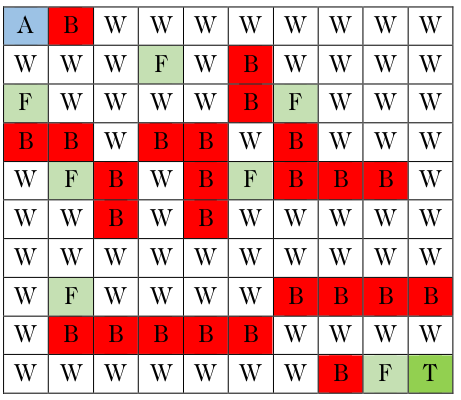
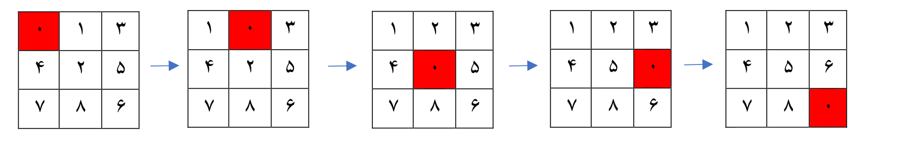

# AI-Course-Projects
## Q-learning for solving a flagged maze
The agent start from the point `A` and needs to reach target `T` and also visit all the Flags `F` along the way

  
  
## 8-puzzle with different algorithms
Solving the 8-puzzle problem with
- DFS(depth-first-search)
- BFS(breadth-first-search)
- IDS(itterative-deepening-search)
- UCS(uniform-cost-search)
- A*

